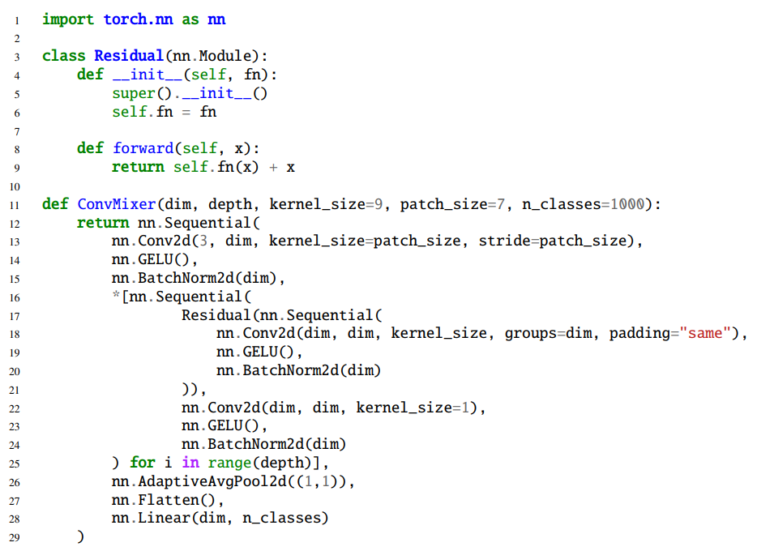

# ConvMixer（卷积 + patch)

+ 论文链接：[Patches Are All You Need?](https://openreview.net/pdf?id=TVHS5Y4dNvM)

## 摘要

ViT（Vision Transformer）的强大性能是来自于Attention还是patch？

该研究提出了 ConvMixer，这是一个极其简单的模型，在思想上与 ViT 和更基本的 MLP-Mixer 相似，这些模型直接将 patch 作为输入进行操作，分离空间和通道维度的混合，并在整个网络中保持相同的大小和分辨率。然而，相比之下，该研究提出的 ConvMixer 仅使用标准卷积来实现混合步骤。尽管它很简单，但研究表明，除了优于 ResNet 等经典视觉模型之外，ConvMixer 在类似的参数计数和数据集大小方面也优于 ViT、MLP-Mixer 及其一些变体。

因为ViTs系列的模型需要将图片分成一个个的patch，再将patch 展平，输入到网络去寻找特征。下面是动画演示：

## 模型理解

+ Patch Embedding与Vit不同，该模型获得Patch Embedding同样是通过卷积的方式，该卷积：output channels为h，kernel size为p，stride也为p，同时stride = kernel size = p，使滑动窗口无重叠

+ 标准卷积：先做空间混合, 对相邻的像素点进行滑动加权求和, 再把所有输入通道的特征加起来

+ ConvMixer Layer将一个标准卷积操作，拆成了Depth-wise convolution（不考虑通道间融合）和point-wise convolution（不考虑相邻点融合），参数减少了一半，因此运算量减少。

## 代码

### 困惑

+ 第3行代码不太理解

+ 第5行代码的 * 的含义还不太清楚

+ 第7行池化参数不太理解

## 实现

### Readable PyTorch Implement

### Simple PyTorch Implement

